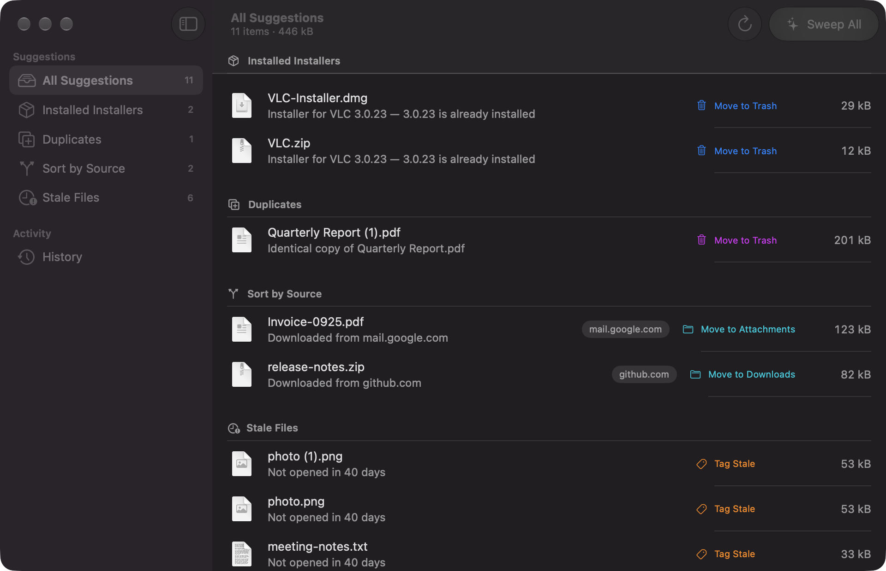
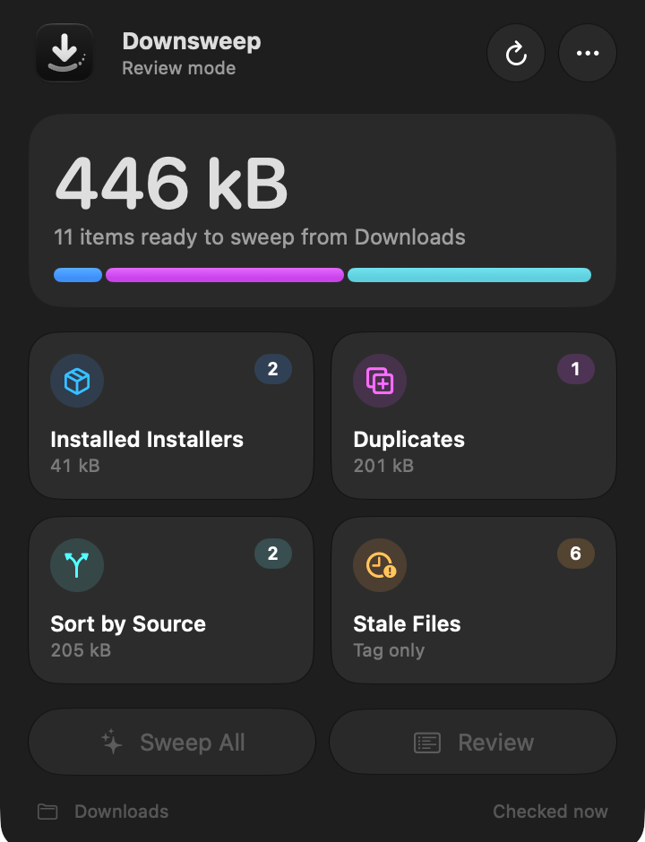
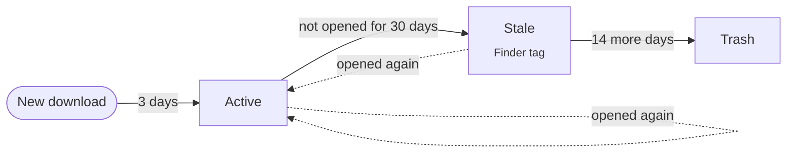

<div align="center">


# Downsweep

**Downloads, swept clean.**

Installers, duplicates and forgotten files, cleared from your menu bar.<br>
A native macOS menu bar app. Free and open source, for macOS 26 Tahoe.

[](https://github.com/muhghazaliakbar/downsweep/releases/latest)
[](https://github.com/muhghazaliakbar/downsweep/actions/workflows/ci.yml)

[](LICENSE)

[**Download for Mac**](https://github.com/muhghazaliakbar/downsweep/releases/latest) · [Website](https://downsweep.justghali.dev) · [Features](#features) · [Install](#install) · [Privacy](#nothing-is-ever-deleted) · [FAQ](#faq)

<br>



</div>

## Features

**Four kinds of clutter. Found on its own.**

| | |
| --- | --- |
| 📦 **Installers** | Already installed? The installer can go. Downsweep looks inside DMG, ZIP and PKG files and compares them with the apps you have (same version or newer). |
| 👯 **Duplicates** | Byte-for-byte copies, verified. `report (1).pdf` is only flagged when it matches `report.pdf` exactly, confirmed with SHA-256. |
| 🧭 **Sort by source** | Files go back where they came from. Browsers record each download's origin, so `mail.google.com` files can go to Attachments and `github.com` files to your code folder. |
| 🕰️ **Stale files** | Untouched for a month? Tagged, then trashed. After 30 days unopened a file gets a Finder "Stale" tag; 14 days later Downsweep suggests the Trash. |

The **Review window** works like Finder: select rows, apply, and undo anytime. Filter by kind, sort by name, date or size, Quick Look any file, and pin or skip the ones that should stay. A **weekly summary** notification every Monday shows what was cleaned, with a card you can share.

> [!IMPORTANT]
> **Nothing is ever deleted.** Everything goes to the Trash, and every action can be undone from History.

## Install

Up and running in a minute. Requires macOS 26 Tahoe or later.

**Homebrew**

```bash
brew install --cask muhghazaliakbar/tap/downsweep
```

**Or download the DMG** from [Releases](https://github.com/muhghazaliakbar/downsweep/releases/latest) and drag Downsweep to Applications.

Downsweep auto-updates via Sparkle, straight from GitHub Releases.

> [!NOTE]
> **First launch.** Downsweep isn't notarized yet, so macOS blocks it the first time:
>
> 1. Open Downsweep.
> 2. Go to **System Settings → Privacy & Security**.
> 3. Click **Open Anyway**, once. Updates install without asking again.

## How it works



Downsweep lives in the menu bar and watches your Downloads folder. When something lands or changes, it scans the top level of the folder and sorts what it finds into four categories.

The popup shows how much space you can reclaim and where it comes from. **Sweep All** does everything at once. **Review** lets you go item by item.

Choose how hands-off you want to be in Settings:

- **Ask me first** (default): Downsweep suggests, you approve.
- **Sweep automatically**: suggestions are applied as they appear. Anything over 50 items or 10 GB still waits for you.

Every file follows the same lifecycle, and each step can be adjusted in Settings → Lifecycle:

<br clear="right">



Installers that are already installed and exact duplicates skip the wait: after a one-hour grace period, they're suggested right away.

## Nothing is ever deleted

- 🔒 **Stays on your Mac.** No analytics, no accounts, and your files never leave your Mac. The only network access is Sparkle checking GitHub for a new version, which you can turn off in Settings → About.
- 🛡️ **Top level only.** Only the top level of the watched folder is touched. Anything that changed in the last 2 minutes (still downloading, copying or unpacking) is left alone.
- ✅ **Re-checked before acting.** Right before acting, each item is checked again: files must still be the same size, and nothing inside a folder may have changed since the scan.
- ↩️ **Undo from History.** Items go to the Trash, never straight to deletion, and History can undo them while they're still there.

Downsweep ships without the App Sandbox. It runs `hdiutil` and `pkgutil` to look inside installers, and those tools don't work reliably from a sandboxed process.

## Roadmap

- [ ] Watch more folders, starting with Desktop
- [ ] Shortcuts actions (App Intents), e.g. "Sweep Downloads now"
- [ ] Companion CLI: `downsweep scan --dry-run`
- [ ] On-device grouping with Apple Foundation Models, staying 100% local
- [ ] Notarized builds (needs a Developer ID certificate)

<details>
<summary><b>Shipped in 1.0</b></summary>

- Lifecycle with a Finder "Stale" tag, then the Trash, with adjustable thresholds
- Installer detection for DMG, ZIP and PKG, compared against installed app versions
- Duplicate detection (`name (1).ext`, `name-1.ext`), confirmed by SHA-256
- Source rules from the browser's download metadata
- Review window with kind filter and Finder-style sorting, History with undo, onboarding
- Ask-first and automatic modes, with a safety limit
- Waits for files to settle before acting
- Live scan progress and a paused state in the menu bar
- Weekly summary notification with a shareable card
- SQLite history store
- English and Indonesian
- Sparkle auto-updates and a Homebrew cask

</details>

Have an idea? [Open an issue](https://github.com/muhghazaliakbar/downsweep/issues).

## FAQ

<details>
<summary><b>Is Downsweep free?</b></summary>

Yes. It's free and open source under the MIT License. If it saves you some tidying time, you can [buy the developer a coffee](#support).

</details>

<details>
<summary><b>Will it delete my files?</b></summary>

No. Everything goes to the Trash, never straight to deletion, and every action can be undone from History while the item is still in the Trash.

</details>

<details>
<summary><b>Why does macOS block it the first time?</b></summary>

Downsweep isn't notarized yet. Open **System Settings → Privacy & Security** and click **Open Anyway**. Updates install without asking again.

</details>

<details>
<summary><b>Does it collect any data?</b></summary>

No analytics and no accounts. Your files never leave your Mac. The only network access is Sparkle checking GitHub for updates, which you can turn off in Settings → About.

</details>

## Development

You'll need Xcode 26 or later.

```bash
git clone https://github.com/muhghazaliakbar/downsweep.git
cd downsweep
open Downsweep.xcodeproj                       # or: xcodebuild -scheme Downsweep build
swift test --package-path Packages/SweepCore   # core tests
```

All decision logic lives in `Packages/SweepCore`, which has no UI and is unit-tested. `PolicyEngine` is a pure function from items to suggestions. If you want to change what Downsweep suggests, start there and in its tests.

<details>
<summary><b>Try it on fake files</b></summary>

Build a fixture folder, then point Downsweep at it in Settings → General → Folder:

```bash
scripts/make-fixtures.sh /tmp/DownsweepFixtures
```

Fixtures are brand new, so nothing looks stale yet. Debug builds accept launch arguments (Xcode: *Edit Scheme → Run → Arguments*):

| Argument | Effect |
| --- | --- |
| `-DebugClockOffsetDays 40` | Treat "now" as 40 days ahead |
| `-DebugOpenReview YES` | Open the Review window at launch |
| `-DebugWeeklySummary YES` | Post the weekly summary notification at launch |

End-to-end test over the fixtures (mounts the DMGs for real):

```bash
DOWNSWEEP_FIXTURES=/tmp/DownsweepFixtures swift test --package-path Packages/SweepCore --filter FixturePipeline
```

</details>

<details>
<summary><b>Project layout</b></summary>

```
Downsweep/                 SwiftUI app: menu bar, Review window, onboarding, Settings
Packages/SweepCore/        All decision logic, UI-free and unit-tested
  Scanner/                 Folder listing + Spotlight metadata (date added, last opened, source URL)
  Inspectors/              DMG / ZIP / PKG inspection, installed-app index, duplicate finder
  Policy/                  PolicyEngine (pure: items → proposals) and SweepPipeline
  Executor/                The only code that touches files: Trash, move, tag, undo
  Watcher/                 FSEvents folder watcher
  Store/                   History (SQLite) and the weekly summary
Config/Info.plist          Sparkle feed URL and public key
scripts/                   Fixtures, releases, appcast, Homebrew cask, string catalogs, icon
```

</details>

<details>
<summary><b>Localization</b></summary>

Strings live in String Catalogs (`Localizable.xcstrings`). After adding user-facing text, pull it into the catalogs, then translate:

```bash
scripts/sync-strings.sh
```

</details>

<details>
<summary><b>Design notes</b></summary>

- The UI follows Apple's Human Interface Guidelines for macOS 26: system fonts, SF Symbols, semantic colours and standard controls.
- Liquid Glass is only used for the navigation and controls layer: menu bar tiles, the floating selection bar, toolbar buttons and the onboarding pager. Content rows stay plain, as the HIG recommends.
- Glass elements that sit next to each other share a `GlassEffectContainer` so they blend and morph together.

</details>

Releasing, Sparkle keys and the Homebrew tap are covered in [docs/RELEASING.md](docs/RELEASING.md).

## Support

Downsweep is free and open source. If it saves you some tidying time, you can buy me a coffee:

<a href="https://buymeacoffee.com/justghali.dev"></a>

## License

Released under the [MIT License](LICENSE).
